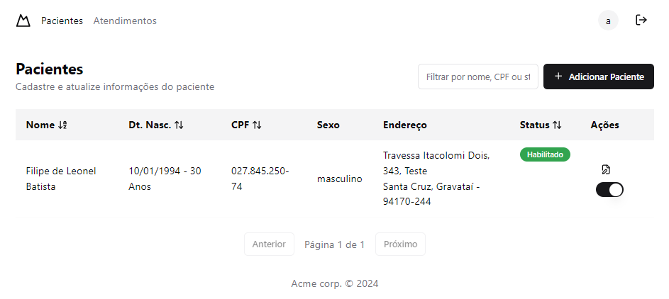
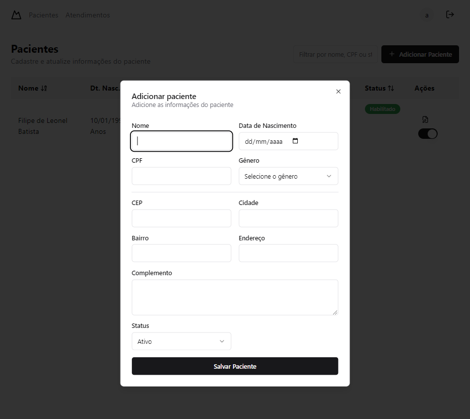
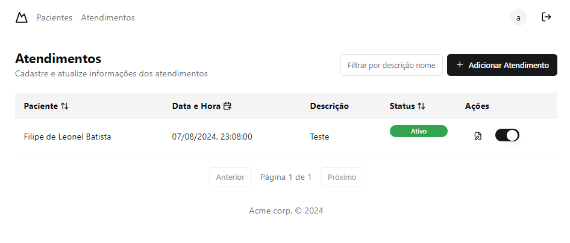
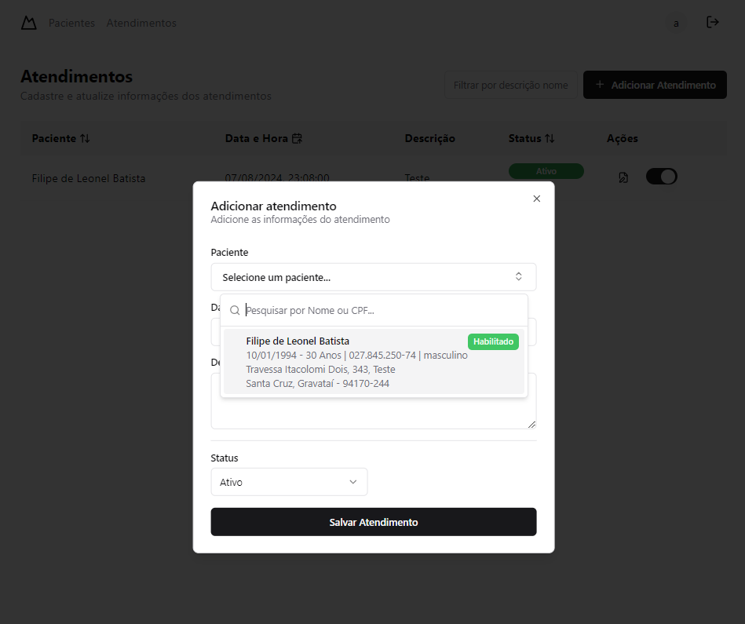

# Cadastro de pacientes e atendimentos Clinica ACME


## Indice

- [Sobre](#-sobre)
- [Tecnologias](#Tecnologias)
- [Instalação](#Instalação)

### 🔖&nbsp; Sobre

Desafio tecnico para criar um CRUD de pacientes de uma clinica ficticia e
um CRUD de atendimento destes pacientes. Mais detalhes do desafio podem ser encontrados no link a baixo

[Desafio](./challenge.md)

---
## Tecnologias

Esse projeto foi desenvolvido com as seguintes principais tecnologias:

- [React JS](https://legacy.reactjs.org/docs/getting-started.html)
- [TailwindCSS](https://tailwindcss.com/)
- [Typescript](https://www.typescriptlang.org/)
- [Shadcn/UI](https://ui.shadcn.com/)

e mais...

---
## Instalação

O projeto roda com [Node.js](https://nodejs.org/) v20+.

Instruções para instalar as dependencias e inicie o projeto.

```sh

cd ip-tech-test
npm i
npm run dev

```


---

<h3 align="center" >Vamos nos conectar 😉</h3>
<p align="center">
  <a href="https://www.linkedin.com/in/filipeleonelbatista/">
    
  </a>&ensp;
  <a href="mailto:filipe.x2016@gmail.com">
    
  </a>&ensp;
  <a href="https://instagram.com/filipeleonelbatista">
    
  </a>
</p>
<br />
<p align="center">
    Desenvolvido 💜 por Filipe Batista 
</p>